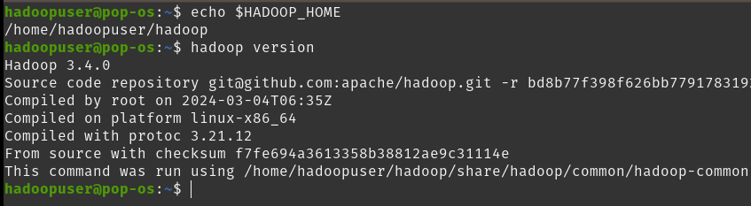

# hadoop-setup
This folder contains resources for setting up and configuring Hadoop.


### A. Minimum System Specifications required for Hadoop framework:

| Component         | Specification                     |
|-------------------|-----------------------------------|
| **Processor**     | Dual-core processor              |
| **RAM**           | At least 4GB                    |
| **Storage**       | Minimum 25 GB of free disk space |
| **Operating System** | Linux-based OS                 |
| **Java**          | Java Development Kit (JDK 8 or later) |
| **Network**       | Basic networking support for localhost |


### B. Apache Hadoop Installation and Configuration:

#### 1. Install Java
To install OpenJDK 11, run the following command:
```bash
sudo apt install openjdk-11-jdk
```

After installation, confirm the Java version with:
```bash
java --version
```

#### 2. Create Hadoop User:
To create dedicated user for Hadoop.
```bash
sudo adduser hadoopuser
```
After creating hadoopuser, switch to it.
```bash 
sudo su -hadoopuser
```
After switching to hadoopuser, Setup SSH Keys.
```bash
ssh-keygen -t rsa
```
And add the public key to authorized keys.
```bash
cat ~/.ssh/id_rsa.pub >> ~/.ssh/authorized_keys
```

#### 3. Download Apache Hadoop
To download hadoop-3.4.0 version.
```bash
wget https://dlcdn.apache.org/hadoop/common/hadoop-3.4.0/hadoop-3.4.0-src.tar.gz
```
For more details and the latest releases, visit the official Apache Hadoop release page:
[Apache Hadoop Releases](https://hadoop.apache.org/releases.html)

After downloading, extract the Hadoop tar file.
```bash
tar -xvzf hadoop-3.4.0.tar.gz
```
#### 4. Set Environment Variables
Open the ```~/.bashrc``` file using a text editor.
```bash
nano ~/.bashrc
```
Add these environment variables to configure Java and Hadoop (modify paths as needed):
```bash
# Java configuration
export JAVA_HOME=/usr/lib/jvm/java-11-openjdk-amd64/
export PATH=$JAVA_HOME/bin:$PATH

# Hadoop configuration
export HADOOP_HOME=~/hadoop-3.4.0
export PATH=$PATH:$HADOOP_HOME/bin:$HADOOP_HOME/sbin
export HADOOP_MAPRED_HOME=$HADOOP_HOME
export HADOOP_COMMON_HOME=$HADOOP_HOME
export HADOOP_HDFS_HOME=$HADOOP_HOME
export YARN_HOME=$HADOOP_HOME

# Native libraries and options
export HADOOP_COMMON_LIB_NATIVE_DIR=$HADOOP_HOME/lib/native
export HADOOP_OPTS="-Djava.library.path=$HADOOP_HOME/lib/native"

# Hadoop classpath
export HADOOP_CLASSPATH=${JAVA_HOME}/lib/tools.jar
```
Run the following command to apply the updated environment variables:
```bash
source ~/.bashrc
```
Check if the Hadoop environment variables are set correctly.
```bash
echo $HADOOP_HOME
```
Verify the Hadoop installation:

```bash
hadoop version
```
You should see an output similar to:


#### 5. Configure `hadoop-env.sh` File

Open the `hadoop-env.sh` configuration file:

```bash
nano ~/hadoop/etc/hadoop/hadoop-env.sh      #location to hadoop-env.sh may vary.
```
Add the following line (or modify if it already exists):
```# Set JAVA_HOME
export JAVA_HOME=/usr/lib/jvm/java-11-openjdk-amd64
```

